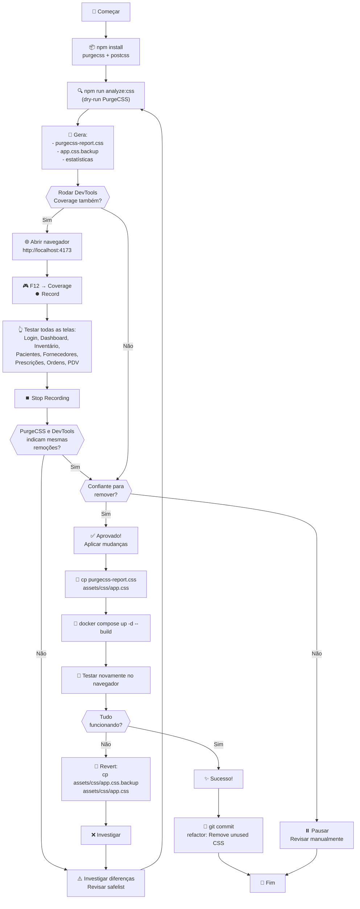

<!--
Visual Flowchart: CSS Cleanup Process
Salve este arquivo como .md e veja em um preview de Markdown
ou copie para: https://mermaid.live
-->

# 📊 Fluxo Visual: Análise e Limpeza Segura de CSS

## Diagrama do Processo Completo



---

## Tabela de Decisão: Quando Proceder?

| Situação                                      | Ação                             |
| --------------------------------------------- | -------------------------------- |
| PurgeCSS ✅ + DevTools ✅ (mesmos resultados) | → Proceder com confiança         |
| PurgeCSS ✅ mas DevTools ⚠️ (diferentes)      | → Investigar ambos, não proceder |
| Backup não existe                             | → NUNCA proceder                 |
| Bootstrap classes no report                   | → Revisar safelist, re-rodar     |
| Testes após aplicação quebram                 | → Revert com `cp .backup`        |
| Erro no console DevTools                      | → NUNCA proceder                 |

---

## Timeline Típica

```
Ação                        Tempo      Acumulado
─────────────────────────────────────────────────
1. npm install               2 min         2 min
2. npm run analyze:css       1 min         3 min
3. Revisar resultado         5 min         8 min
4. DevTools Coverage test   10 min        18 min
5. Comparação resultados    5 min        23 min
6. Aplicar mudanças          2 min        25 min
7. Rebuild stack             2 min        27 min
8. Testar app               10 min        37 min
9. git commit               3 min        40 min
─────────────────────────────────────────────────
TOTAL                                    40 min
```

---

## Arquivos Envolvidos

```
Before:
├── frontend/
│   ├── assets/css/
│   │   ├── app.css              (original, ~5KB)
│   │   └── theme.css            (tokens)
│   └── pages/
│       ├── dashboard.html
│       ├── inventory.html
│       ├── patients.html
│       └── ... (6 mais)
│
After (após análise):
├── frontend/
│   ├── assets/css/
│   │   ├── app.css              (original, 5KB)
│   │   └── app.css.backup       ← NEW (5KB, segurança)
│   ├── purgecss-report.css      ← NEW (4.2KB, limpo)
│   ├── purgecss.config.js       ← NEW (config)
│   └── scripts/
│       ├── analyze-css-usage.js ← NEW (script)
│       └── css-cleanup-checklist.sh ← NEW (guia)
```

---

## Checklist Interativa

### ✅ Pré-requisitos (antes de começar)

- [ ] Docker está rodando (`docker ps`)
- [ ] Stack backend pronta (`docker compose up -d api db`)
- [ ] npm instalado (`npm --version`)
- [ ] Você está em `frontend/` directory

### ✅ Fase 1: Análise

- [ ] PurgeCSS instalado (`npm install --save-dev purgecss`)
- [ ] Configuração criada (`purgecss.config.js`)
- [ ] Análise rodou (`npm run analyze:css`)
- [ ] Estatísticas mostradas (X% removível)

### ✅ Fase 2: Validação

- [ ] DevTools Coverage aberto (F12 → Coverage)
- [ ] TODAS as 8 telas testadas (Dashboard, Inventário, etc)
- [ ] Modais testados
- [ ] Formulários testados
- [ ] Responsivo testado (mobile via DevTools)

### ✅ Fase 3: Comparação

- [ ] PurgeCSS resultado salvo
- [ ] DevTools coverage exportado
- [ ] Ambos indicam mesmos CSS não usado?
- [ ] Nenhuma Bootstrap class foi marcada?

### ✅ Fase 4: Aplicação

- [ ] Backup confirmado existe (`app.css.backup`)
- [ ] CSS limpo copiado (`cp purgecss-report.css`)
- [ ] Stack rebuilda (`docker compose up -d`)
- [ ] Nenhum erro visual

### ✅ Fase 5: Testes Finais

- [ ] Login funciona
- [ ] Dashboard renderiza sem erros
- [ ] Todas páginas carregam
- [ ] Console DevTools limpo (sem erros CSS)
- [ ] Responsivo OK

### ✅ Fase 6: Commit

- [ ] Git branch criada (`refactor/purge-unused-css`)
- [ ] Mudanças staged (`git add`)
- [ ] Commit message descritivo
- [ ] Pushed para origin (`git push`)
- [ ] PR criada para review

---

## Sanidade Checks (Verification)

```bash
# 1. Verificar que backup foi criado
ls -la frontend/assets/css/app.css.backup
# Expected: file exists

# 2. Verificar tamanho foi reduzido
wc -c frontend/assets/css/app.css frontend/assets/css/app.css.backup
# Expected: app.css < app.css.backup

# 3. Verificar que Bootstrap classes preservadas
grep -c "\.btn-" frontend/assets/css/app.css
# Expected: > 0 (se estava antes)

# 4. Verificar que CSS válido (sem syntax errors)
npx postcss --syntax css frontend/assets/css/app.css
# Expected: exit 0 (OK)

# 5. Verificar que não foi apagado acidentalmente
wc -l frontend/assets/css/app.css
# Expected: > 100 (não é arquivo vazio!)
```

---

## Rollback Rápido (Se algo quebrou)

```bash
# 1. Revert CSS
cp frontend/assets/css/app.css.backup frontend/assets/css/app.css

# 2. Rebuild
docker compose up -d --build

# 3. Testar
open http://localhost:4173

# 4. Se OK, git revert
git revert HEAD

# 5. Investigar o que deu errado
# Re-rode PurgeCSS com mais verbosidade
```

---

## Próximos Passos Após Sucesso

- [ ] Monitorar em staging (se aplicável)
- [ ] Observar user reports (se houver)
- [ ] Documentar resultado (% economizado)
- [ ] Considerar repetir trimestral (JS muda, CSS cresce)
- [ ] Adicionar `npm run analyze:css` ao CI/CD (alertar se cresce)

---

## FAQ Rápido

**P: PurgeCSS vai remover classes Bootstrap?**
R: Não, se a `safelist` estiver correto. `purgecss.config.js` já tem.

**P: DevTools Coverage mostrou 100% uso, mas PurgeCSS acha 10% não usado?**
R: Possível que você não testou uma tela. Re-rode Coverage com cuidado.

**P: Posso rodar PurgeCSS sem DevTools Coverage?**
R: Não recomendo. DevTools testa em runtime; PurgeCSS é estático. Combine ambos.

**P: Preciso fazer isso frequentemente?**
R: Quarterly é ok. Toda vez que adiciona JS novo, CSS cresce — bom revisar.

**P: E se eu remover CSS e depois cliente pedir a página antiga?**
R: Tenha sempre `app.css.backup` commitada no git. Revert com `git revert`.

---

**Diagrama em SVG/PNG:** Para visualizar melhor, copie o código mermaid para https://mermaid.live
